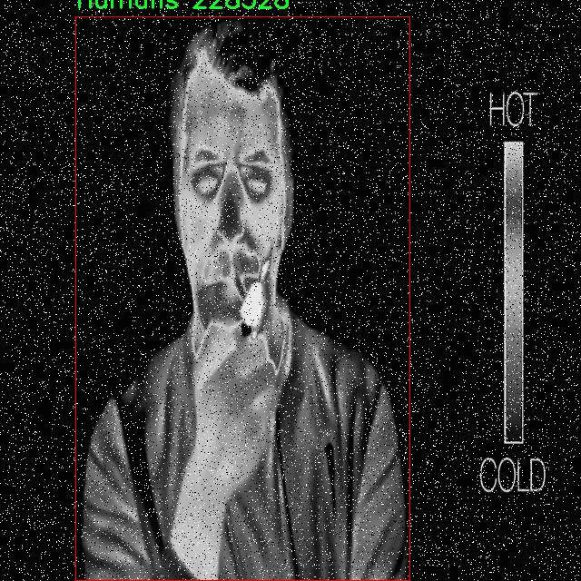

# 热成像行人检测检测系统源码分享
 # [一条龙教学YOLOV8标注好的数据集一键训练_70+全套改进创新点发刊_Web前端展示]

### 1.研究背景与意义

项目参考[AAAI Association for the Advancement of Artificial Intelligence](https://gitee.com/qunmasj/projects)

项目来源[AACV Association for the Advancement of Computer Vision](https://github.com/qunshansj/good)

研究背景与意义

随着城市化进程的加快和智能监控技术的迅速发展，行人检测作为计算机视觉领域的重要研究方向，受到了广泛关注。尤其是在复杂环境下，传统的可见光图像处理方法往往受到光照、天气和遮挡等因素的影响，导致检测效果不佳。因此，基于热成像技术的行人检测系统逐渐成为研究热点。热成像技术能够在低光照和恶劣天气条件下，依然有效地捕捉到目标的热辐射信息，从而实现高效的目标检测。

在这一背景下，YOLO（You Only Look Once）系列模型因其高效的实时检测能力而被广泛应用于各种目标检测任务。YOLOv8作为该系列的最新版本，结合了深度学习的最新进展，具备了更强的特征提取能力和更快的推理速度。然而，YOLOv8在处理热成像图像时，仍然面临着特征提取不足和环境适应性差等挑战。因此，针对热成像数据集进行改进和优化，构建基于改进YOLOv8的热成像行人检测系统，具有重要的研究意义。

本研究所使用的数据集包含4475幅热成像图像，涵盖了四个类别：人类、狗、男性和其他行人。这一数据集的多样性为模型的训练和测试提供了丰富的样本，能够有效提升模型的泛化能力。尤其是在行人检测中，考虑到不同体型、姿态和穿着的行人，数据集的多样性使得模型能够更好地适应现实场景中的复杂性。此外，热成像图像的特征与可见光图像有显著不同，改进YOLOv8的特征提取模块，使其能够更好地适应热成像数据的特性，将为行人检测提供新的思路。

通过对YOLOv8的改进，研究将重点关注热成像图像的特征提取、数据增强和模型优化等方面。首先，针对热成像图像的特点，设计特定的卷积层和激活函数，以提高模型对热成像特征的敏感性。其次，利用数据增强技术，增加训练样本的多样性，提升模型的鲁棒性和准确性。最后，通过调整损失函数和优化算法，进一步提高模型的收敛速度和检测精度。

本研究的意义不仅在于推动热成像行人检测技术的发展，更在于为智能监控、公共安全、无人驾驶等领域提供有效的技术支持。随着社会对安全监控需求的增加，基于热成像的行人检测系统将能够在夜间、雾霾等低能见度条件下，依然保持高效的检测能力，为城市安全管理提供有力保障。此外，该研究也为后续的热成像目标检测研究提供了理论基础和实践经验，推动相关领域的进一步发展。

综上所述，基于改进YOLOv8的热成像行人检测系统的研究，既是对现有技术的挑战与创新，也是对社会安全需求的积极响应，具有重要的学术价值和现实意义。

### 2.图片演示


##### 注意：由于此博客编辑较早，上面“2.图片演示”和“3.视频演示”展示的系统图片或者视频可能为老版本，新版本在老版本的基础上升级如下：（实际效果以升级的新版本为准）

  （1）适配了YOLOV8的“目标检测”模型和“实例分割”模型，通过加载相应的权重（.pt）文件即可自适应加载模型。

  （2）支持“图片识别”、“视频识别”、“摄像头实时识别”三种识别模式。

  （3）支持“图片识别”、“视频识别”、“摄像头实时识别”三种识别结果保存导出，解决手动导出（容易卡顿出现爆内存）存在的问题，识别完自动保存结果并导出到tempDir中。

  （4）支持Web前端系统中的标题、背景图等自定义修改，后面提供修改教程。

  另外本项目提供训练的数据集和训练教程,暂不提供权重文件（best.pt）,需要您按照教程进行训练后实现图片演示和Web前端界面演示的效果。

### 3.视频演示

[3.1 视频演示](https://www.bilibili.com/video/BV1mXHseFEuQ/?vd_source=ff015de2d29cbe2a9cdbfa7064407a08)

### 4.数据集信息展示

##### 4.1 本项目数据集详细数据（类别数＆类别名）

nc: 4
names: ['Humans', 'dog', 'mens', 'person']


##### 4.2 本项目数据集信息介绍

数据集信息展示

在现代计算机视觉领域，热成像技术因其在低光照和复杂环境下的优越性能而受到广泛关注。为了推动热成像行人检测系统的研究与应用，特别是基于YOLOv8模型的改进，构建一个高质量的数据集显得尤为重要。本次研究所采用的数据集名为“thermal person”，该数据集专门针对热成像场景下的行人检测任务进行了精心设计，旨在为模型的训练和评估提供丰富而多样的样本。

“thermal person”数据集包含四个主要类别，分别是“Humans”、“dog”、“mens”和“person”。这些类别的选择不仅考虑到了行人检测的实际需求，还涵盖了与人类活动相关的其他目标物体，从而使得模型在多种环境下的适应性和准确性得以提升。具体而言，“Humans”类别包括各种姿态和行为的行人，能够反映出不同场景下行人的多样性；“dog”类别则增加了对宠物的检测能力，这在城市环境中尤为常见，且可能对行人检测产生干扰；“mens”类别则专注于男性行人的特征，提供了性别识别的额外维度；而“person”类别则是一个更为广泛的分类，涵盖了所有人类目标，确保了数据集的全面性。

数据集的构建过程中，研究团队注重样本的多样性和代表性。每个类别的样本均来自于不同的环境条件，包括城市街道、乡村小道、商业区和公园等场景，确保模型在实际应用中能够应对各种复杂情况。此外，数据集中的图像均为热成像图，具有独特的温度信息，这为模型的训练提供了重要的特征支持。通过对不同目标的热特征进行标注，研究团队能够为YOLOv8模型提供准确的训练数据，从而提升其在热成像环境下的检测性能。

为了进一步增强数据集的实用性，研究团队还对图像进行了多种数据增强处理，包括旋转、缩放、翻转等操作。这些处理不仅增加了样本的数量，还提高了模型的鲁棒性，使其能够更好地适应不同的视角和尺度变化。此外，数据集的标注工作也经过严格的审核，确保每个目标的边界框和类别标签的准确性，以减少模型训练过程中的误差。

总之，“thermal person”数据集为改进YOLOv8的热成像行人检测系统提供了坚实的基础。通过丰富的类别设置和多样的样本来源，该数据集不仅能够有效支持模型的训练和评估，还为未来在热成像领域的研究提供了重要的数据支撑。随着技术的不断进步和应用场景的不断扩展，期待该数据集能够为热成像行人检测的研究者和开发者带来更多的启发与帮助。




### 5.全套项目环境部署视频教程（零基础手把手教学）

[5.1 环境部署教程链接（零基础手把手教学）](https://www.ixigua.com/7404473917358506534?logTag=c807d0cbc21c0ef59de5)


[5.2 安装Python虚拟环境创建和依赖库安装视频教程链接（零基础手把手教学）](https://www.ixigua.com/7404474678003106304?logTag=1f1041108cd1f708b01a)

### 6.手把手YOLOV8训练视频教程（零基础小白有手就能学会）

[6.1 环境部署教程链接（零基础手把手教学）](https://www.ixigua.com/7404477157818401292?logTag=d31a2dfd1983c9668658)

### 7.70+种全套YOLOV8创新点代码加载调参视频教程（一键加载写好的改进模型的配置文件）

[7.1 环境部署教程链接（零基础手把手教学）](https://www.ixigua.com/7404478314661806627?logTag=29066f8288e3f4eea3a4)

### 8.70+种全套YOLOV8创新点原理讲解（非科班也可以轻松写刊发刊，V10版本正在科研待更新）

由于篇幅限制，每个创新点的具体原理讲解就不一一展开，具体见下列网址中的创新点对应子项目的技术原理博客网址【Blog】：


[8.1 70+种全套YOLOV8创新点原理讲解链接](https://gitee.com/qunmasj/good)

### 9.系统功能展示（检测对象为举例，实际内容以本项目数据集为准）

图9.1.系统支持检测结果表格显示

  图9.2.系统支持置信度和IOU阈值手动调节

  图9.3.系统支持自定义加载权重文件best.pt(需要你通过步骤5中训练获得)

  图9.4.系统支持摄像头实时识别

  图9.5.系统支持图片识别

  图9.6.系统支持视频识别

  图9.7.系统支持识别结果文件自动保存

  图9.8.系统支持Excel导出检测结果数据


### 10.原始YOLOV8算法原理

原始YOLOv8算法原理

YOLOv8作为YOLO系列中的最新成员，代表了目标检测领域的一次重要进步。与其前身YOLOv5相比，YOLOv8在检测精度和速度上都取得了显著的提升，展现出更为强大的性能。YOLOv8的设计不仅仅是对前代模型的简单改进，而是基于深度学习技术的最新发展，融合了多种先进的网络结构和优化策略，旨在满足不同应用场景的需求。

YOLOv8网络的结构可以分为四个主要部分：输入端、骨干网络、颈部网络和头部网络。输入端的设计非常重要，它采用了马赛克数据增强技术、自适应锚框计算和自适应灰度填充等手段。这些技术的应用不仅增强了数据的多样性，还提高了模型在不同环境下的鲁棒性。马赛克数据增强通过将多张图像拼接在一起，增加了训练样本的多样性，从而使模型能够更好地适应各种场景。

在骨干网络部分，YOLOv8引入了C2f模块和SPPF（Spatial Pyramid Pooling Fusion）结构。C2f模块的设计灵感来源于YOLOv7的ELAN结构，通过更多的分支和跨层连接，显著增强了模型的梯度流。这种结构使得网络能够更有效地学习到更丰富的特征表示，从而提升了目标检测的精度。同时，SPPF结构通过多尺度特征融合，进一步增强了模型对不同尺度目标的检测能力。

颈部网络采用了路径聚合网络（PAN）结构，旨在加强不同尺度特征的融合能力。PAN通过对特征图进行多层次的处理，使得模型能够更好地捕捉到目标的细节信息。这种特征融合的策略使得YOLOv8在处理复杂场景时，能够更准确地识别出目标，尤其是在小目标检测方面表现尤为突出。

头部网络是YOLOv8的核心部分，它将分类和检测过程进行了有效的解耦。传统的目标检测模型往往将分类和检测过程耦合在一起，导致模型在处理复杂场景时的灵活性不足。而YOLOv8通过引入解耦头结构，将分类和回归分支分开处理，使得模型在训练和推理时能够更高效地进行任务分配。损失计算过程中，YOLOv8采用了Task-Aligned Assigner策略，根据分类与回归的分数加权结果选择正样本。这种策略的引入，进一步提升了模型的训练效率和检测精度。

在损失函数的设计上，YOLOv8结合了二元交叉熵损失（BCELoss）和分布焦点损失（DFLoss）以及完全交并比损失函数（CIOULoss），以提高模型对边界框预测的精准性。这种多损失函数的组合，能够有效地平衡分类和回归任务之间的关系，使得模型在面对复杂场景时，能够保持较高的准确率。

YOLOv8的另一个重要创新是其轻量化设计。YOLOv8n版本作为最小参数量的模型，专为实时性和模型大小可控而设计。通过对骨干特征提取网络层的优化，YOLOv8n使用了更轻量化的C2F模块，减少了计算复杂度，同时保持了较高的检测精度。这种轻量化设计使得YOLOv8能够在资源受限的设备上运行，扩展了其应用场景。

在特征融合网络方面，YOLOv8n结合了特征金字塔网络（FPN）和路径聚合网络（PAN），并引入了BiFPN网络，以提高模型对不同尺度特征信息的提取速度。BiFPN网络通过高效的双向跨尺度连接和加权特征融合，进一步提升了模型的性能，使得YOLOv8在处理多尺度目标时表现得更加出色。

总的来说，YOLOv8通过一系列创新的设计和优化策略，极大地提升了目标检测的精度和速度。其新的骨干网络、解耦头结构以及多样化的损失函数设计，使得YOLOv8在计算机视觉领域中脱颖而出，成为当前最先进的目标检测模型之一。无论是在学术研究还是实际应用中，YOLOv8都展现出了强大的潜力，推动了目标检测技术的进一步发展。随着YOLOv8的广泛应用，我们可以期待其在更多领域的深入探索和创新。


### 11.项目核心源码讲解（再也不用担心看不懂代码逻辑）

#### 11.1 ultralytics\utils\callbacks\dvc.py

以下是经过简化和注释的核心代码部分，保留了主要功能，并添加了详细的中文注释：

```python
# 导入必要的库
from ultralytics.utils import LOGGER, SETTINGS, TESTS_RUNNING, checks
import os
import re
from pathlib import Path

# 尝试导入DVCLive并进行基本的检查
try:
    assert not TESTS_RUNNING  # 确保不是在测试中
    assert SETTINGS["dvc"] is True  # 确保DVC集成已启用
    import dvclive

    # 检查dvclive版本
    assert checks.check_version("dvclive", "2.11.0", verbose=True)

    # DVCLive日志实例
    live = None
    _processed_plots = {}  # 存储已处理的图表
    _training_epoch = False  # 标记当前是否为训练周期

except (ImportError, AssertionError, TypeError):
    dvclive = None  # 如果导入失败，则将dvclive设置为None


def _log_images(path, prefix=""):
    """记录指定路径的图像，使用DVCLive进行日志记录。"""
    if live:  # 如果DVCLive已初始化
        name = path.name
        # 通过批次分组图像，以便在UI中启用滑块
        m = re.search(r"_batch(\d+)", name)
        if m:
            ni = m[1]
            new_stem = re.sub(r"_batch(\d+)", "_batch", path.stem)
            name = (Path(new_stem) / ni).with_suffix(path.suffix)

        live.log_image(os.path.join(prefix, name), path)  # 记录图像


def _log_plots(plots, prefix=""):
    """记录训练进度的图像，如果它们尚未被处理。"""
    for name, params in plots.items():
        timestamp = params["timestamp"]
        if _processed_plots.get(name) != timestamp:  # 检查图表是否已处理
            _log_images(name, prefix)  # 记录图像
            _processed_plots[name] = timestamp  # 更新已处理图表的时间戳


def _log_confusion_matrix(validator):
    """使用DVCLive记录给定验证器的混淆矩阵。"""
    targets = []
    preds = []
    matrix = validator.confusion_matrix.matrix
    names = list(validator.names.values())
    if validator.confusion_matrix.task == "detect":
        names += ["background"]  # 如果任务是检测，添加背景类

    # 填充目标和预测列表
    for ti, pred in enumerate(matrix.T.astype(int)):
        for pi, num in enumerate(pred):
            targets.extend([names[ti]] * num)
            preds.extend([names[pi]] * num)

    live.log_sklearn_plot("confusion_matrix", targets, preds, name="cf.json", normalized=True)  # 记录混淆矩阵


def on_pretrain_routine_start(trainer):
    """在预训练例程开始时初始化DVCLive日志记录器。"""
    try:
        global live
        live = dvclive.Live(save_dvc_exp=True, cache_images=True)  # 初始化DVCLive
        LOGGER.info("DVCLive已检测到，自动记录已启用。")
    except Exception as e:
        LOGGER.warning(f"警告 ⚠️ DVCLive安装但未正确初始化，未记录此运行。{e}")


def on_fit_epoch_end(trainer):
    """在每个拟合周期结束时记录训练指标和模型信息。"""
    global _training_epoch
    if live and _training_epoch:  # 如果DVCLive已初始化且当前为训练周期
        all_metrics = {**trainer.label_loss_items(trainer.tloss, prefix="train"), **trainer.metrics, **trainer.lr}
        for metric, value in all_metrics.items():
            live.log_metric(metric, value)  # 记录所有指标

        _log_plots(trainer.plots, "train")  # 记录训练图表
        live.next_step()  # 进入下一个步骤
        _training_epoch = False  # 重置训练周期标记


def on_train_end(trainer):
    """在训练结束时记录最佳指标、图表和混淆矩阵。"""
    if live:
        all_metrics = {**trainer.label_loss_items(trainer.tloss, prefix="train"), **trainer.metrics, **trainer.lr}
        for metric, value in all_metrics.items():
            live.log_metric(metric, value, plot=False)  # 记录最佳指标

        _log_plots(trainer.plots, "val")  # 记录验证图表
        _log_confusion_matrix(trainer.validator)  # 记录混淆矩阵

        live.end()  # 结束日志记录


# 定义回调函数
callbacks = {
    "on_pretrain_routine_start": on_pretrain_routine_start,
    "on_fit_epoch_end": on_fit_epoch_end,
    "on_train_end": on_train_end,
} if dvclive else {}
```

### 代码核心部分说明：
1. **导入和初始化**：导入必要的库，并尝试初始化DVCLive，确保在训练过程中能够记录日志。
2. **图像和图表记录**：定义了记录图像和图表的函数，以便在训练过程中跟踪进度。
3. **混淆矩阵记录**：记录混淆矩阵以评估模型性能。
4. **训练过程中的回调**：在训练的不同阶段（如开始、结束、每个周期结束）调用相应的函数来记录训练参数和指标。

这个文件 `dvc.py` 是 Ultralytics YOLO 项目中的一个回调模块，主要用于集成 DVCLive 进行训练过程的日志记录和可视化。文件开头导入了一些必要的模块和库，包括日志记录器、设置和检查函数。它首先进行了一些初始化检查，确保在非测试环境下运行，并且确认 DVCLive 集成已启用。如果这些条件不满足，DVCLive 将不会被使用。

在成功导入 DVCLive 后，定义了一些全局变量，包括一个用于记录图像的实例 `live` 和一个用于存储已处理图像的字典 `_processed_plots`。接下来，定义了一些用于记录不同类型数据的私有函数。

`_log_images` 函数用于记录指定路径下的图像，并在图像名称中添加可选前缀。它通过正则表达式将图像按批次分组，以便在用户界面中启用滑块功能。`_log_plots` 函数则用于记录训练过程中的图像，如果这些图像之前没有被处理过。`_log_confusion_matrix` 函数用于记录混淆矩阵，帮助分析模型的分类性能。

接下来的几个函数是训练过程中的回调函数。`on_pretrain_routine_start` 在预训练开始时初始化 DVCLive 记录器，并记录相关信息。`on_pretrain_routine_end` 在预训练结束时记录训练过程中的图像。`on_train_start` 在训练开始时记录训练参数。`on_train_epoch_start` 则在每个训练周期开始时设置一个全局变量，指示当前正在进行训练。

`on_fit_epoch_end` 是在每个训练周期结束时调用的函数，它记录训练指标和模型信息，并准备进入下一个步骤。在这个函数中，会记录所有的训练指标，包括损失、学习率等，并在第一轮训练时记录模型信息。最后，`on_train_end` 在训练结束时记录最佳指标、图像和混淆矩阵。

最后，文件定义了一个回调字典 `callbacks`，其中包含了所有的回调函数，如果 DVCLive 被成功导入并初始化，则将这些回调函数添加到字典中，以便在训练过程中调用。

总体而言，这个文件的主要功能是通过 DVCLive 实现训练过程的实时监控和可视化，帮助用户更好地理解和分析模型的训练情况。

#### 11.2 ultralytics\utils\dist.py

以下是经过简化和注释的核心代码部分：

```python
import os
import shutil
import socket
import sys
import tempfile

from . import USER_CONFIG_DIR
from .torch_utils import TORCH_1_9

def find_free_network_port() -> int:
    """
    查找本地主机上可用的网络端口。

    这个函数在单节点训练时非常有用，因为我们不想连接到真实的主节点，但必须设置
    `MASTER_PORT` 环境变量。
    """
    with socket.socket(socket.AF_INET, socket.SOCK_STREAM) as s:
        s.bind(("127.0.0.1", 0))  # 绑定到本地地址和随机端口
        return s.getsockname()[1]  # 返回绑定的端口号


def generate_ddp_file(trainer):
    """生成 DDP 文件并返回其文件名。"""
    # 获取训练器的模块和类名
    module, name = f"{trainer.__class__.__module__}.{trainer.__class__.__name__}".rsplit(".", 1)

    # 构建 DDP 文件的内容
    content = f"""
# Ultralytics 多 GPU 训练临时文件（使用后应自动删除）
overrides = {vars(trainer.args)}

if __name__ == "__main__":
    from {module} import {name}
    from ultralytics.utils import DEFAULT_CFG_DICT

    cfg = DEFAULT_CFG_DICT.copy()
    cfg.update(save_dir='')   # 处理额外的 'save_dir' 键
    trainer = {name}(cfg=cfg, overrides=overrides)
    results = trainer.train()
"""
    # 创建 DDP 目录（如果不存在）
    (USER_CONFIG_DIR / "DDP").mkdir(exist_ok=True)
    
    # 创建临时文件并写入内容
    with tempfile.NamedTemporaryFile(
        prefix="_temp_",
        suffix=f"{id(trainer)}.py",
        mode="w+",
        encoding="utf-8",
        dir=USER_CONFIG_DIR / "DDP",
        delete=False,
    ) as file:
        file.write(content)  # 写入内容到临时文件
    return file.name  # 返回临时文件的名称


def generate_ddp_command(world_size, trainer):
    """生成并返回用于分布式训练的命令。"""
    import __main__  # 本地导入以避免某些问题

    if not trainer.resume:
        shutil.rmtree(trainer.save_dir)  # 如果不恢复训练，删除保存目录
    file = generate_ddp_file(trainer)  # 生成 DDP 文件
    dist_cmd = "torch.distributed.run" if TORCH_1_9 else "torch.distributed.launch"  # 根据 PyTorch 版本选择命令
    port = find_free_network_port()  # 查找可用端口
    # 构建命令列表
    cmd = [sys.executable, "-m", dist_cmd, "--nproc_per_node", f"{world_size}", "--master_port", f"{port}", file]
    return cmd, file  # 返回命令和文件名


def ddp_cleanup(trainer, file):
    """如果创建了临时文件，则删除它。"""
    if f"{id(trainer)}.py" in file:  # 检查临时文件后缀
        os.remove(file)  # 删除临时文件
```

### 代码说明：
1. **查找可用端口**：`find_free_network_port` 函数用于查找本地主机上一个可用的网络端口，以便在分布式训练中使用。
2. **生成 DDP 文件**：`generate_ddp_file` 函数根据训练器的参数生成一个临时 Python 文件，该文件包含了训练的必要配置和启动代码。
3. **生成分布式训练命令**：`generate_ddp_command` 函数构建用于启动分布式训练的命令，包括所需的参数和文件名。
4. **清理临时文件**：`ddp_cleanup` 函数用于在训练结束后删除生成的临时文件，以避免文件堆积。

这个程序文件是用于处理分布式训练的工具，主要是与Ultralytics YOLO模型相关的。文件中包含了一些函数，帮助在单节点训练中生成分布式数据并行（DDP）所需的文件和命令。

首先，`find_free_network_port`函数用于查找本地主机上一个可用的网络端口。这在单节点训练时非常有用，因为我们需要设置`MASTER_PORT`环境变量，而不需要连接到真实的主节点。函数通过创建一个TCP套接字并绑定到本地地址来实现这一点，返回可用的端口号。

接下来，`generate_ddp_file`函数用于生成一个DDP文件，并返回该文件的名称。这个文件包含了训练器的配置信息和训练逻辑。具体来说，它从训练器对象中提取参数，并构建一个Python脚本的内容，该脚本会在主程序中导入训练器类并执行训练。生成的文件会被保存在用户配置目录下的“DDP”文件夹中，使用临时文件的方式创建，以确保在使用后可以自动删除。

然后，`generate_ddp_command`函数用于生成分布式训练的命令。它首先检查训练器是否需要恢复之前的训练，如果不需要，则删除保存目录。接着调用`generate_ddp_file`生成临时文件，并根据PyTorch的版本选择合适的分布式运行命令（`torch.distributed.run`或`torch.distributed.launch`）。该函数还会调用`find_free_network_port`获取一个可用的端口，并最终构建出一个命令列表，包含了执行Python脚本所需的所有参数。

最后，`ddp_cleanup`函数用于清理临时文件。如果生成的临时文件名包含训练器的ID，则会将其删除，以避免留下不必要的文件。

整体来看，这个文件的功能是为Ultralytics YOLO模型的分布式训练提供支持，简化了训练配置和命令生成的过程，确保在训练完成后能够清理临时文件。

#### 11.3 ui.py

```python
import sys
import subprocess

def run_script(script_path):
    """
    使用当前 Python 环境运行指定的脚本。

    Args:
        script_path (str): 要运行的脚本路径

    Returns:
        None
    """
    # 获取当前 Python 解释器的路径
    python_path = sys.executable

    # 构建运行命令
    command = f'"{python_path}" -m streamlit run "{script_path}"'

    # 执行命令
    result = subprocess.run(command, shell=True)
    if result.returncode != 0:
        print("脚本运行出错。")


# 实例化并运行应用
if __name__ == "__main__":
    # 指定您的脚本路径
    script_path = "web.py"  # 这里直接指定脚本路径

    # 运行脚本
    run_script(script_path)
```

### 代码核心部分及注释

1. **导入必要的模块**：
   - `sys`：用于访问与 Python 解释器相关的变量和函数。
   - `subprocess`：用于执行外部命令和程序。

2. **定义 `run_script` 函数**：
   - 该函数接受一个参数 `script_path`，表示要运行的 Python 脚本的路径。
   - 使用 `sys.executable` 获取当前 Python 解释器的路径，以确保在正确的环境中运行脚本。
   - 构建一个命令字符串，使用 `streamlit` 模块运行指定的脚本。
   - 使用 `subprocess.run` 执行构建的命令，并检查返回码以确定脚本是否成功运行。

3. **主程序入口**：
   - 使用 `if __name__ == "__main__":` 确保只有在直接运行该脚本时才会执行以下代码。
   - 指定要运行的脚本路径（这里为 `web.py`）。
   - 调用 `run_script` 函数来执行指定的脚本。

这个程序文件的主要功能是使用当前的 Python 环境来运行一个指定的脚本，具体来说是运行一个名为 `web.py` 的脚本。文件首先导入了必要的模块，包括 `sys`、`os` 和 `subprocess`，以及一个自定义的 `abs_path` 函数，用于获取脚本的绝对路径。

在 `run_script` 函数中，首先获取当前 Python 解释器的路径，这样可以确保使用正确的 Python 环境来执行脚本。接着，构建一个命令字符串，这个命令会调用 `streamlit` 模块来运行指定的脚本。`streamlit` 是一个用于构建数据应用的库，通常用于快速创建和分享数据可视化应用。

随后，使用 `subprocess.run` 方法来执行构建好的命令。这个方法会在一个新的 shell 中运行命令，并等待其完成。如果脚本运行过程中出现错误，返回的 `returncode` 将不为零，此时程序会打印出“脚本运行出错”的提示信息。

在文件的最后部分，使用 `if __name__ == "__main__":` 语句来确保只有在直接运行该文件时才会执行后面的代码。在这里，首先调用 `abs_path` 函数来获取 `web.py` 的绝对路径，然后调用 `run_script` 函数来执行这个脚本。

总的来说，这个程序文件提供了一种简单的方式来运行指定的 Python 脚本，并处理可能出现的错误。

#### 11.4 ultralytics\models\yolo\segment\__init__.py

以下是代码中最核心的部分，并附上详细的中文注释：

```python
# 导入所需的模块
from .predict import SegmentationPredictor  # 导入分割预测器类
from .train import SegmentationTrainer      # 导入分割训练器类
from .val import SegmentationValidator      # 导入分割验证器类

# 定义模块的公开接口，指定可以被外部访问的类
__all__ = "SegmentationPredictor", "SegmentationTrainer", "SegmentationValidator"
```

### 注释说明：
1. **导入模块**：
   - `from .predict import SegmentationPredictor`：从当前包的 `predict` 模块中导入 `SegmentationPredictor` 类，该类用于进行图像分割的预测。
   - `from .train import SegmentationTrainer`：从当前包的 `train` 模块中导入 `SegmentationTrainer` 类，该类用于训练分割模型。
   - `from .val import SegmentationValidator`：从当前包的 `val` 模块中导入 `SegmentationValidator` 类，该类用于验证分割模型的性能。

2. **定义公开接口**：
   - `__all__` 是一个特殊的变量，用于定义模块的公共接口。当使用 `from module import *` 时，只有在 `__all__` 中列出的名称会被导入。这里列出了三个类，表示它们是该模块的主要功能部分。

这个程序文件是Ultralytics YOLO项目中的一个模块，主要用于图像分割的功能。文件名为`__init__.py`，通常用于标识一个目录为Python包，并可以在包被导入时执行一些初始化操作。

在这个文件中，首先有一行注释，说明这是Ultralytics YOLO项目的一部分，并提到该项目遵循AGPL-3.0许可证。这意味着该项目是开源的，用户可以自由使用和修改，但需要遵循相应的许可证条款。

接下来，文件通过相对导入的方式引入了三个类：`SegmentationPredictor`、`SegmentationTrainer`和`SegmentationValidator`。这些类分别用于图像分割的预测、训练和验证功能。具体来说，`SegmentationPredictor`可能负责对输入图像进行分割预测，`SegmentationTrainer`用于训练分割模型，而`SegmentationValidator`则用于验证模型的性能。

最后，`__all__`变量被定义为一个元组，包含了上述三个类的名称。这一行的作用是控制从这个模块中导入时的行为。当使用`from module import *`语句时，只有在`__all__`中列出的名称会被导入。这有助于避免命名冲突，并明确哪些类是模块的公共接口。

总的来说，这个文件是Ultralytics YOLO图像分割模块的初始化文件，主要负责导入相关的类并定义公共接口。

#### 11.5 train.py

以下是经过简化和注释的核心代码部分：

```python
import os
import torch
import yaml
from ultralytics import YOLO  # 导入YOLO模型库
from QtFusion.path import abs_path  # 导入路径处理函数

# 设置设备为GPU（如果可用），否则使用CPU
device = "0" if torch.cuda.is_available() else "cpu"

if __name__ == '__main__':  # 确保该模块被直接运行时才执行以下代码
    # 定义工作进程数和批次大小
    workers = 1
    batch = 2

    # 数据集名称
    data_name = "data"
    # 获取数据集配置文件的绝对路径
    data_path = abs_path(f'datasets/{data_name}/{data_name}.yaml', path_type='current')
    
    # 获取数据集目录路径
    directory_path = os.path.dirname(data_path)
    
    # 读取YAML配置文件
    with open(data_path, 'r') as file:
        data = yaml.load(file, Loader=yaml.FullLoader)
    
    # 修改YAML文件中的路径项
    if 'path' in data:
        data['path'] = directory_path  # 更新路径为当前目录
        # 将修改后的数据写回YAML文件
        with open(data_path, 'w') as file:
            yaml.safe_dump(data, file, sort_keys=False)

    # 加载YOLOv8模型
    model = YOLO(model='./ultralytics/cfg/models/v8/yolov8s.yaml', task='detect')
    
    # 开始训练模型
    results2 = model.train(
        data=data_path,  # 指定训练数据的配置文件路径
        device=device,  # 使用指定的设备进行训练
        workers=workers,  # 指定工作进程数
        imgsz=640,  # 输入图像大小
        epochs=100,  # 训练的轮数
        batch=batch,  # 每个批次的大小
        name='train_v8_' + data_name  # 训练任务的名称
    )
```

### 代码注释说明：
1. **导入库**：导入必要的库，包括操作系统库、PyTorch、YAML解析库和YOLO模型库。
2. **设备选择**：根据是否有可用的GPU选择设备，若有则使用GPU，否则使用CPU。
3. **主程序入口**：确保代码在直接运行时执行。
4. **参数设置**：定义工作进程数和批次大小。
5. **数据集路径**：根据数据集名称构建数据集配置文件的绝对路径。
6. **读取和修改YAML文件**：读取YAML文件内容，更新其中的路径项，并将修改后的内容写回文件。
7. **模型加载**：加载YOLOv8模型，准备进行目标检测任务。
8. **模型训练**：调用训练方法，传入数据路径、设备、工作进程数、图像大小、训练轮数、批次大小和任务名称等参数，开始训练模型。

这个程序文件 `train.py` 的主要功能是使用 YOLOv8 模型进行目标检测的训练。首先，程序导入了必要的库，包括 `os`、`torch`、`yaml` 和 `ultralytics` 中的 YOLO 模型。接着，程序检查是否可以使用 GPU，如果可以，则将设备设置为 "0"（表示使用第一个 GPU），否则使用 CPU。

在 `if __name__ == '__main__':` 语句下，程序确保只有在直接运行该脚本时才会执行以下代码。首先，定义了工作进程数 `workers` 和批次大小 `batch`，然后指定数据集的名称为 "data"。接下来，程序构建了数据集 YAML 文件的绝对路径，并将路径中的分隔符替换为 Unix 风格的分隔符。

程序接着获取了目录路径，并打开指定的 YAML 文件以读取数据。读取后，程序检查 YAML 数据中是否包含 `path` 项，如果有，则将其修改为当前目录路径，并将修改后的数据写回到 YAML 文件中。

然后，程序加载了预训练的 YOLOv8 模型，指定了模型的配置文件。接下来，调用 `model.train()` 方法开始训练模型。在训练过程中，程序指定了训练数据的配置文件路径、设备、工作进程数、输入图像的大小（640x640）、训练的 epoch 数（100）以及每个批次的大小（2）。最后，训练任务的名称被设置为 `'train_v8_' + data_name`，即 `train_v8_data`。

总的来说，这个程序实现了从数据集准备到模型训练的完整流程，适合用于目标检测任务的训练。

#### 11.6 model.py

以下是代码中最核心的部分，并附上详细的中文注释：

```python
# -*- coding: utf-8 -*-
import cv2  # 导入OpenCV库，用于处理图像和视频
import torch  # 导入PyTorch库，用于深度学习模型的处理
from ultralytics import YOLO  # 从ultralytics库中导入YOLO类，用于加载YOLO模型
from ultralytics.utils.torch_utils import select_device  # 导入选择设备的工具函数

# 选择计算设备，如果有可用的GPU则使用GPU，否则使用CPU
device = "cuda:0" if torch.cuda.is_available() else "cpu"

# 初始化参数字典
ini_params = {
    'device': device,  # 设备类型
    'conf': 0.25,  # 物体置信度阈值
    'iou': 0.5,  # 用于非极大值抑制的IOU阈值
    'classes': None,  # 类别过滤器，None表示不过滤任何类别
    'verbose': False  # 是否详细输出
}

class Web_Detector:  # 定义Web_Detector类
    def __init__(self, params=None):  # 构造函数
        self.model = None  # 初始化模型为None
        self.img = None  # 初始化图像为None
        self.params = params if params else ini_params  # 使用提供的参数或默认参数

    def load_model(self, model_path):  # 加载模型的方法
        self.device = select_device(self.params['device'])  # 选择计算设备
        task = 'segment' if os.path.basename(model_path)[:3] == 'seg' else 'detect'  # 根据模型路径判断任务类型
        self.model = YOLO(model_path, task=task)  # 加载YOLO模型
        self.model(torch.zeros(1, 3, 640, 640).to(self.device).type_as(next(self.model.model.parameters())))  # 预热模型

    def preprocess(self, img):  # 预处理方法
        self.img = img  # 保存原始图像
        return img  # 返回处理后的图像

    def predict(self, img):  # 预测方法
        results = self.model(img, **ini_params)  # 使用模型进行预测
        return results  # 返回预测结果

    def postprocess(self, pred):  # 后处理方法
        results = []  # 初始化结果列表
        for res in pred[0].boxes:  # 遍历预测结果中的每个边界框
            class_id = int(res.cls.cpu())  # 获取类别ID
            bbox = res.xyxy.cpu().squeeze().tolist()  # 获取边界框坐标并转换为列表
            bbox = [int(coord) for coord in bbox]  # 将边界框坐标转换为整数

            result = {
                "class_name": self.model.names[class_id],  # 获取类别名称
                "bbox": bbox,  # 边界框
                "score": res.conf.cpu().squeeze().item(),  # 置信度
                "class_id": class_id  # 类别ID
            }
            results.append(result)  # 将结果添加到列表
        return results  # 返回结果列表
```

### 代码说明：
1. **设备选择**：根据是否有可用的GPU选择计算设备。
2. **参数初始化**：定义了一个包含模型参数的字典，包括设备类型、置信度阈值等。
3. **Web_Detector类**：这是主要的检测类，包含模型加载、图像预处理、预测和后处理的方法。
4. **模型加载**：根据模型路径判断任务类型（检测或分割），并加载YOLO模型。
5. **图像预处理**：保存原始图像，方便后续处理。
6. **预测**：使用YOLO模型对输入图像进行预测，返回预测结果。
7. **后处理**：解析预测结果，提取类别名称、边界框、置信度等信息，并将其整理成列表返回。

这个程序文件 `model.py` 是一个用于图像检测的模块，主要基于YOLO（You Only Look Once）模型进行物体检测。文件中首先导入了必要的库，包括OpenCV用于图像处理，PyTorch用于深度学习操作，以及自定义的Detector和HeatmapGenerator类。此外，还导入了一个中文名称列表，用于将检测到的类别转换为中文名称。

程序的开头部分定义了一些初始化参数，包括设备类型（使用CUDA或CPU）、物体置信度阈值、IOU阈值和类别过滤器等。接着，定义了一个名为 `count_classes` 的函数，用于统计检测结果中每个类别的数量。该函数接收检测信息和类别名称列表，返回一个按照类别顺序排列的数量列表。

接下来，定义了一个名为 `Web_Detector` 的类，继承自 `Detector` 类。这个类的构造函数初始化了一些属性，包括模型、图像和类别名称等。它还定义了一个 `load_model` 方法，用于加载YOLO模型。根据模型路径的前缀判断是进行分割任务还是检测任务，并加载相应的模型。同时，将模型中的类别名称转换为中文，并进行预热处理。

`preprocess` 方法用于对输入图像进行预处理，简单地将原始图像保存并返回。`predict` 方法则用于执行预测，调用YOLO模型进行物体检测，并返回结果。

`postprocess` 方法对预测结果进行后处理，提取出每个检测框的类别名称、边界框坐标、置信度和类别ID等信息，并将这些信息存储在一个结果列表中返回。最后，`set_param` 方法用于更新检测器的参数。

总体而言，这个程序文件实现了一个基于YOLO模型的物体检测系统，能够加载模型、处理图像、进行预测并返回检测结果，适用于需要进行实时物体检测的应用场景。

### 12.系统整体结构（节选）

### 整体功能和构架概括

该项目是一个基于Ultralytics YOLO模型的目标检测和图像分割系统。它提供了完整的训练、推理和可视化功能，支持分布式训练和实时监控。项目的核心功能包括模型的加载、训练、预测、后处理和结果可视化。通过一系列模块和工具，用户可以方便地进行目标检测和图像分割任务，同时支持与外部工具（如DVCLive）集成以实现训练过程的监控。

项目的整体架构可以分为以下几个部分：

1. **模型模块**：包括YOLO模型及其变体（如分割和RTDETR），负责模型的定义、训练和推理。
2. **工具模块**：提供了训练、分布式训练、回调函数和其他实用工具的实现，支持模型的高效训练和监控。
3. **用户界面模块**：提供了与用户交互的功能，如运行特定脚本和展示结果。
4. **数据处理模块**：负责数据的预处理和后处理，确保输入数据的正确性和输出结果的可用性。

### 文件功能整理表

| 文件路径                                             | 功能描述                                                     |
|----------------------------------------------------|------------------------------------------------------------|
| `ultralytics/utils/callbacks/dvc.py`              | 集成DVCLive进行训练过程的日志记录和可视化。                       |
| `ultralytics/utils/dist.py`                        | 支持分布式训练，生成DDP文件和命令，查找可用网络端口。                |
| `ui.py`                                           | 运行指定的Python脚本（如web.py），提供用户界面功能。                |
| `ultralytics/models/yolo/segment/__init__.py`     | 初始化图像分割模块，导入相关类（如SegmentationPredictor等）。      |
| `train.py`                                        | 负责模型的训练流程，包括数据集准备、模型加载和训练过程的启动。      |
| `model.py`                                        | 实现YOLO模型的加载、图像处理、预测和后处理功能。                    |
| `ultralytics/utils/callbacks/base.py`             | 定义基础回调类，供其他回调类继承和扩展。                           |
| `ultralytics/__init__.py`                         | 初始化Ultralytics包，设置包的公共接口。                           |
| `utils.py`                                        | 提供各种实用工具函数，可能包括数据处理、文件操作等功能。              |
| `ultralytics/utils/triton.py`                     | 可能与Triton推理服务器集成，支持模型的在线推理。                    |
| `ultralytics/models/sam/build.py`                 | 负责构建SAM（Segment Anything Model）模型的相关功能。              |
| `ultralytics/models/rtdetr/__init__.py`           | 初始化RTDETR模型模块，导入相关类和功能。                          |
| `ultralytics/models/rtdetr/val.py`                 | 实现RTDETR模型的验证功能，评估模型性能。                           |

这个表格总结了项目中各个文件的主要功能，帮助理解项目的整体结构和模块间的关系。

注意：由于此博客编辑较早，上面“11.项目核心源码讲解（再也不用担心看不懂代码逻辑）”中部分代码可能会优化升级，仅供参考学习，完整“训练源码”、“Web前端界面”和“70+种创新点源码”以“13.完整训练+Web前端界面+70+种创新点源码、数据集获取”的内容为准。

### 13.完整训练+Web前端界面+70+种创新点源码、数据集获取


https://mbd.pub/o/bread/ZpqZmply